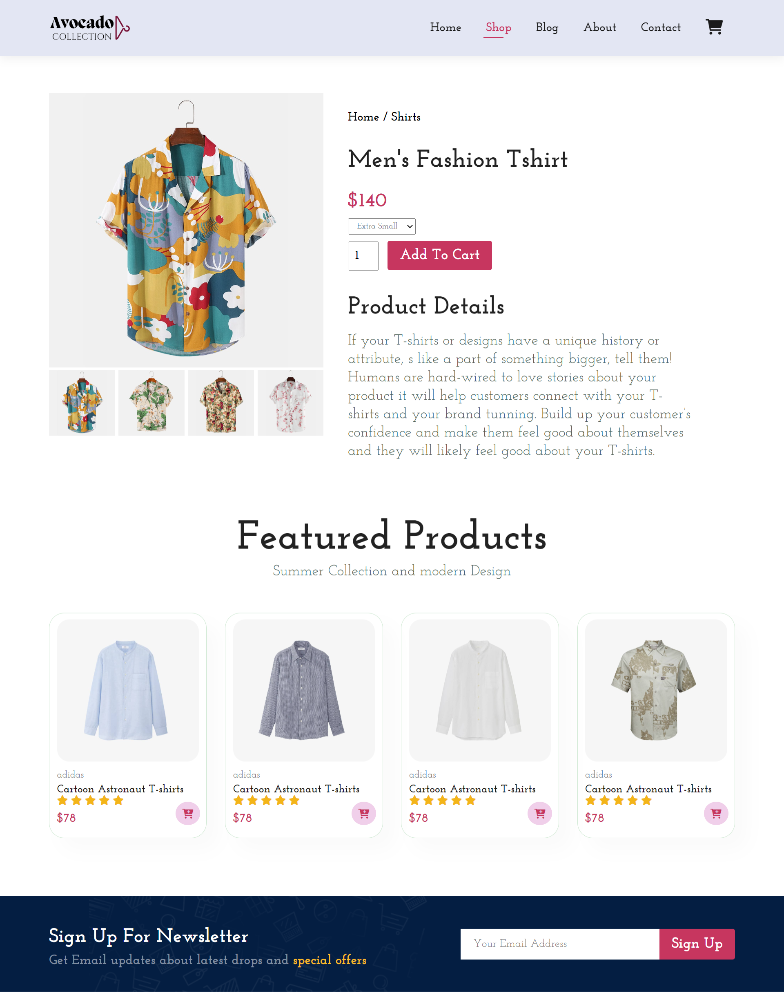
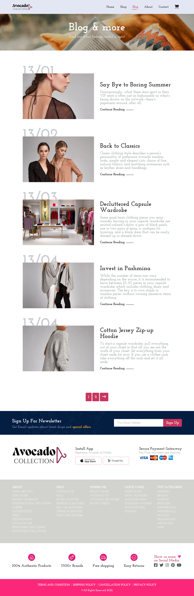
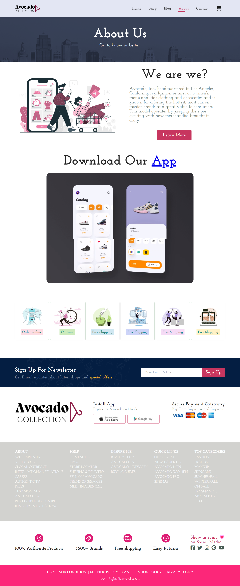
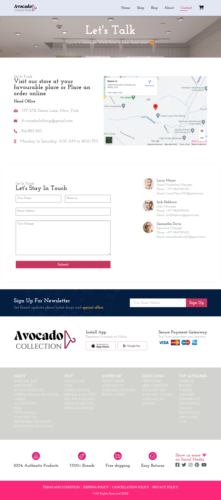

# Avocado Ecommerce site
## Index

- [About](#about)
- [Demo](#demo)
- [Built with](#technologies)
- [Preview](#preview)
- [Features](#features)
- [Run Locally](#local)
- [Feedback](#feedback)


<a id='about'/>

 ## :information_source: About

Avocado is the Modern UX/UI Multipage Ecommerce site. <br/>

<a id='demo'/>

## :link: Demo

[Click to see Live Demo](https://avocado-full-ecommerce-store.vercel.app/)


<a id='technologies'/>

## :hammer: Built With

This project was developed only using:

  - HTMl
  - CSS
  - Javascript


<a id='features'/>

## :fire: Salient Features

- Modern Multipage website
- Layout using CSS flexbox and grid
- Use of Modern UX and UI
- soft and smooth animations
- Fully Responsive along all devices 
- Cross platform
- complex realworld footer

<a id='preview'/>

## :framed_picture: Preview

Check out how it looks:


<div>





</div>

<div>





</div>


<a id='local'/>

## :computer: Run Locally

Clone the project

```bash
  git clone git@github.com:clair-daisies/Avocado-Full-Ecommerce-Store.git
```

Go to the project directory

```bash
  cd Avocado-Full-Ecommerce-website
```

Spin up the server

```bash
  serve via Live-server
```

<a id='feedback'/>

## :love_letter: Feedback

If you have any feedback, please reach out to me at 

<p align="center">
<br/>


#### Navbar

- CSS flexbox
- CSS animations
